# Windows 12 OS

A futuristic browser-based simulation of the next generation Windows operating system, built completely using web technologies. This project recreates the feel of a modern desktop environment with built-in applications, authentication flow, command prompt interactions, system utilities, and a polished UI experience.

---

## 🚀 Live Experience

Experience a modern desktop operating system directly inside the browser.

### Features Included

* Initial boot and setup experience
* Authentication system
* Interactive desktop UI
* Menu bar and navigation system
* Functional Calculator
* Notepad with live word count
* MS Paint clone
* Digital Clock
* Command Prompt simulation
* Command-based app launching
* Google access through terminal commands
* Brightness controls
* Settings panel
* Multi-window desktop interactions
* Responsive and animated UI

---

# 🖥️ Project Screenshots

## Initial Setup

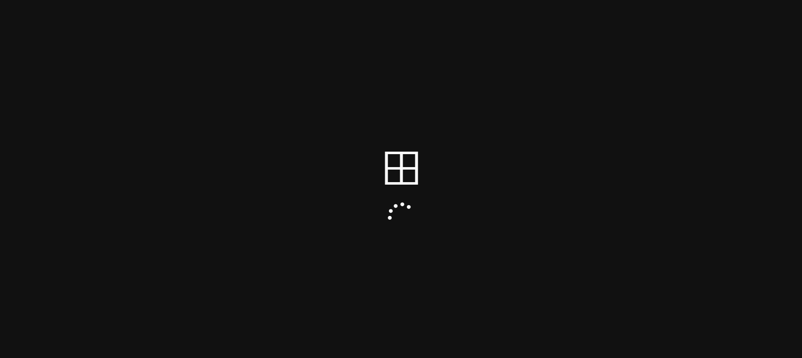

## Loading Screen


## Authentication


## Welcome Page

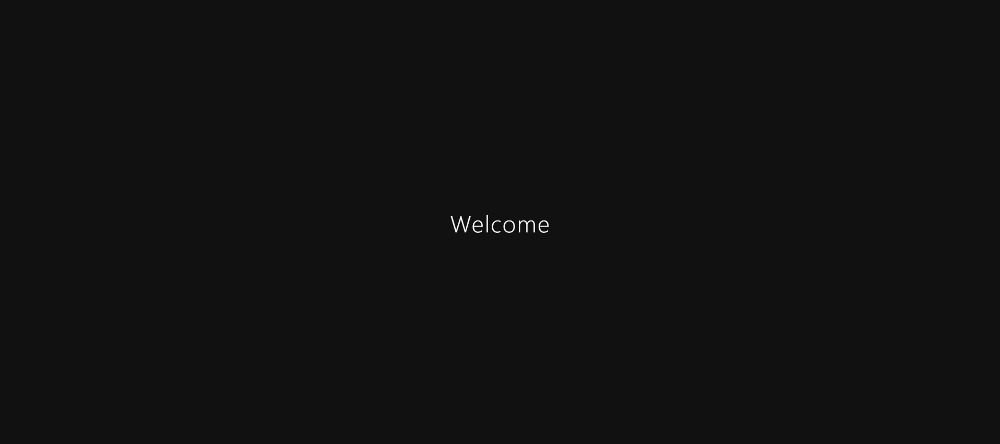

## Desktop Home Screen

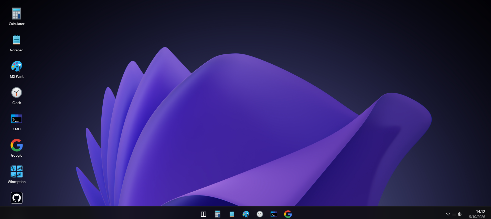

## Menu Bar

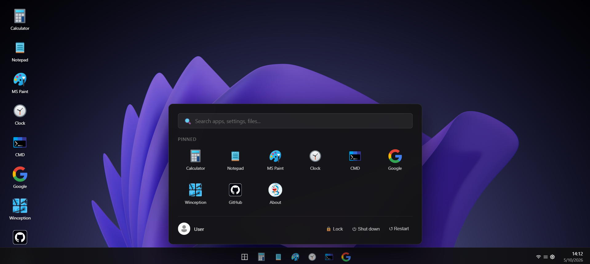

## Calculator Application

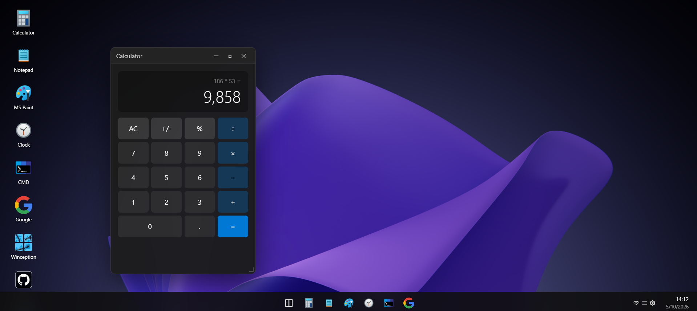

## Notepad Application

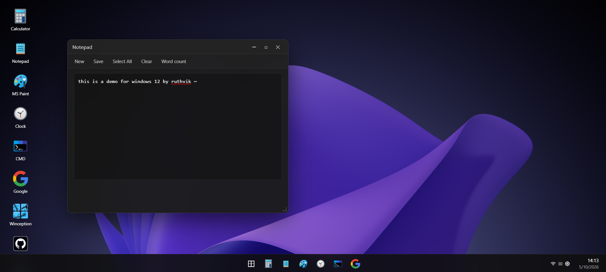

## Live Word Count

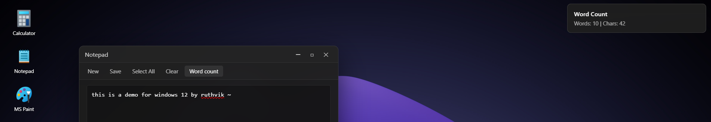

## MS Paint

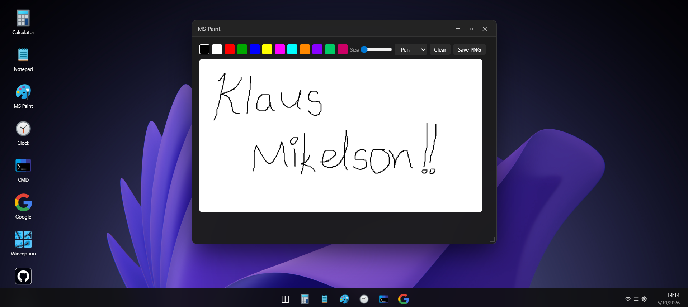

## Clock Widget

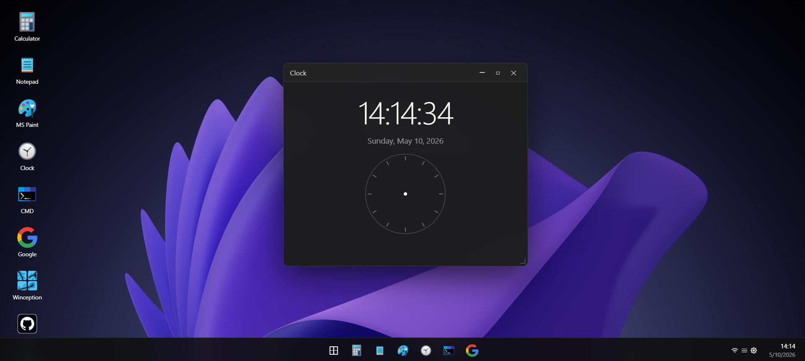

## Command Prompt

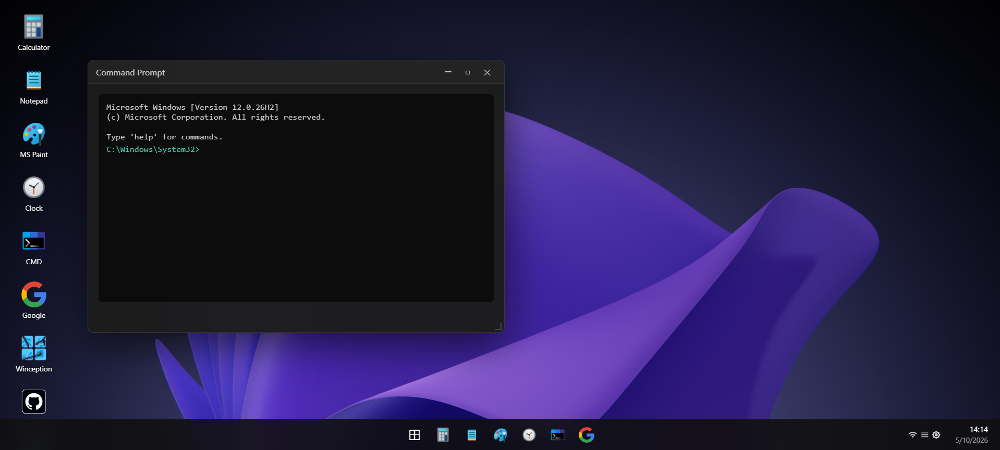

## Basic Terminal Commands

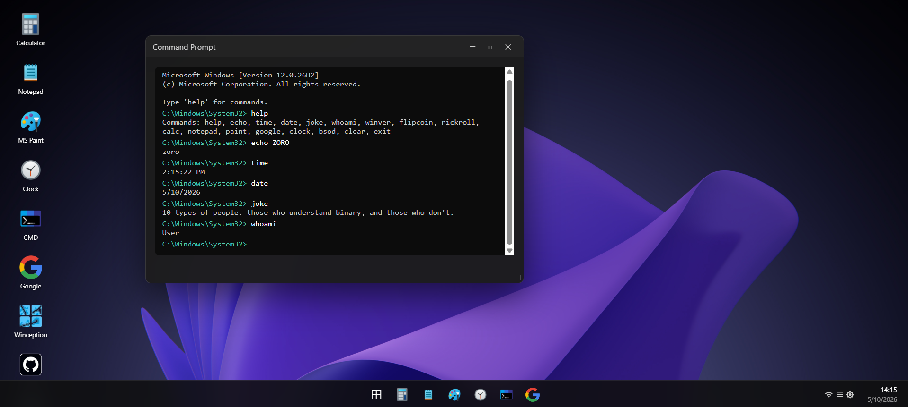

## Calculator via Command Prompt

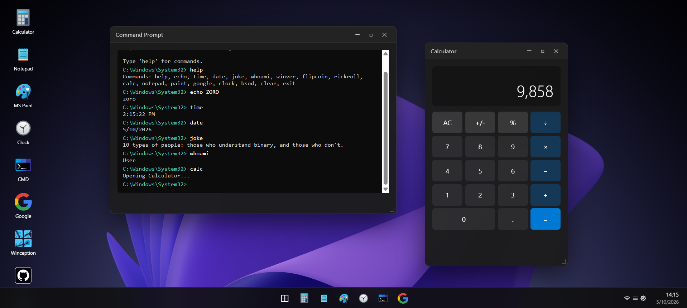

## Notepad via Command Prompt

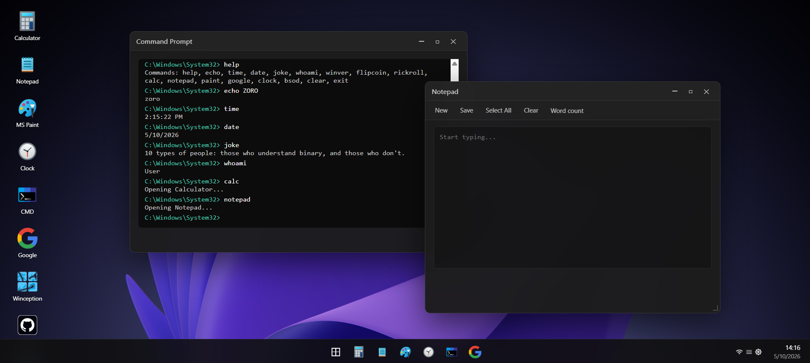

## Google Access via Command Prompt

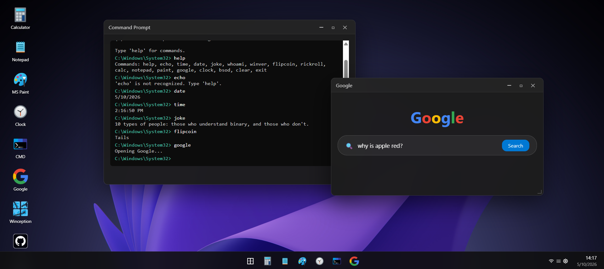

## GitHub Repository Access

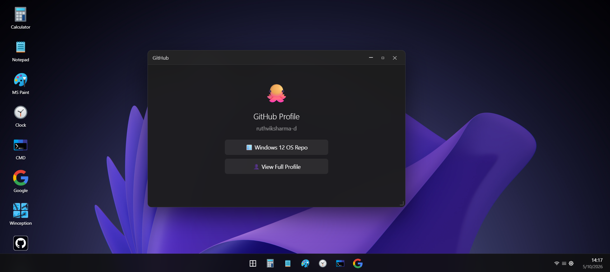

## Settings Panel

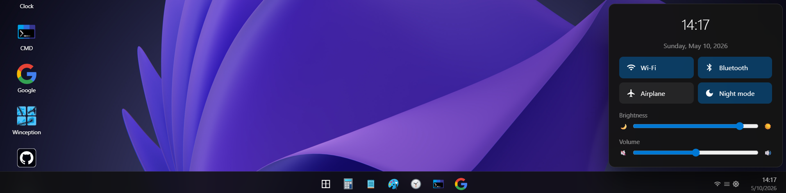

## Brightness Adjustment Demo

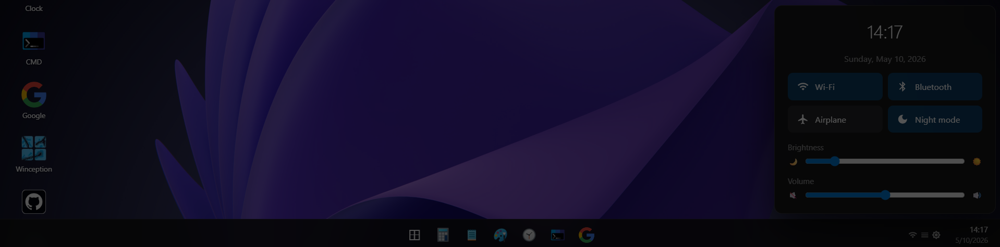

---

# ✨ Core Highlights

## 🔐 Authentication Flow

The OS starts with a realistic login and authentication experience that mimics modern operating systems.

## 🪟 Window-Based Desktop Environment

Applications open in independent windows similar to a real desktop operating system.

## 💻 Built-In Applications

Several custom-built applications are integrated into the environment:

* Calculator
* Notepad
* Paint
* Clock
* Settings
* Command Prompt

## ⌨️ Interactive Command Prompt

The command prompt supports multiple commands and can launch applications directly from terminal inputs.

Example commands:

```bash
calc
notepad
google
github
help
clear
```

## 🎨 Modern UI Design

The interface focuses on:

* Smooth transitions
* Modern layouts
* Desktop aesthetics
* Glassmorphism inspired UI
* Clean icon placements
* Responsive components

---

# 🛠️ Tech Stack

## Frontend

* HTML5
* CSS3
* JavaScript

## UI & Design

* Responsive layouts
* CSS animations
* Interactive desktop elements

## Browser APIs Used

* DOM Manipulation
* Local Storage
* Event Handling
* Dynamic Rendering

---

# 📂 Project Structure

```bash
windows-12-os/
│
├── images/
├── index.html
└── README.md
```

---

# ⚙️ Installation & Setup

## Clone the Repository

```bash
git clone https://github.com/ruthviksharma-d/windows-12-os.git
```

## Open the Project

Simply open:

```bash
index.html
```

in your browser.

No additional dependencies or installations required.

---

# 🎯 Project Goals

This project was created to:

* Simulate a futuristic desktop operating system
* Explore advanced frontend UI interactions
* Learn window management systems
* Build browser-based desktop applications
* Recreate operating system workflows using web technologies

---

# 🔥 Unique Features

## Browser-Based Operating System

Runs entirely in the browser without backend infrastructure.

## Terminal Controlled Apps

Applications can be launched directly from the command prompt.

## Realistic Desktop Experience

Designed to feel close to an actual operating system.

## Lightweight Architecture

No frameworks or heavy dependencies.

---

# 📈 Future Improvements

Planned enhancements include:

* File explorer system
* Drag and resize windows
* Virtual assistant integration
* AI-powered command prompt
* Browser application
* Music player
* Multi-tab terminal
* File system simulation
* Themes and customization
* Voice commands
* User profiles
* Desktop widgets
* Task manager
* Notifications system
* Cloud sync support

---

# 💡 Inspiration

Inspired by modern desktop operating systems and futuristic UI concepts while exploring what a next-generation browser OS could feel like.

---

# 🤝 Contributions

Contributions, ideas, and improvements are welcome.

Fork the repository and create a pull request.

---

# 📜 License

This project is open-source and available under the MIT License.

---

# 👨‍💻 Developer

Developed by Ruthvik Sharma.

GitHub: [https://github.com/ruthviksharma-d](https://github.com/ruthviksharma-d)
